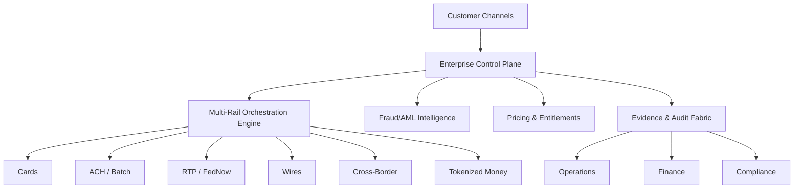

# Digital-Payment-Systems
A comprehensive, architecture‑driven repository documenting modern Digital Payment Systems, including multi‑rail payment orchestration, AI‑native modernization frameworks, ISO 20022 transformation patterns, and enterprise‑grade resiliency models

## 📁 Repository Structure

Digital-Payment-Systems/
│
├── architectures/
│   ├── multi-rail-orchestration.md
│   ├── enterprise-control-plane.md
│   ├── iso20022-processing.md
│   └── tokenized-money-architecture.md
│
├── frameworks/
│   ├── ERMI.md        # Enterprise Rail Modernization Index
│   ├── LNBA.md        # Legacy-to-Next Banking Architecture
│   ├── UICS.md        # Unified Intelligent Control Stack
│   └── AIDV.md        # AI-Driven Validation Framework
│
├── ai-workflows/
│   ├── exception-handling.md
│   ├── reconciliation-automation.md
│   ├── fraud-aml-intelligence.md
│   └── agentic-payment-flows.md
│
├── iso20022/
│   ├── mapping-patterns.md
│   ├── validation-rules.md
│   └── migration-risk-models.md
│
├── tokenized-money/
│   ├── tokenized-deposits.md
│   ├── stablecoin-settlement.md
│   └── programmable-b2b-flows.md
│
└── README.md

## 🧩 High-Level Architecture (Diagram)

## 🧩 Featured Original Frameworks

- **ERMI** – Enterprise Rail Modernization Index  
- **LNBA** – Legacy‑to‑Next Banking Architecture  
- **UICS** – Unified Intelligent Control Stack  
- **AIDV** – AI‑Driven Validation Framework  
- **SLM‑Driven Payment Cognition Models**  

