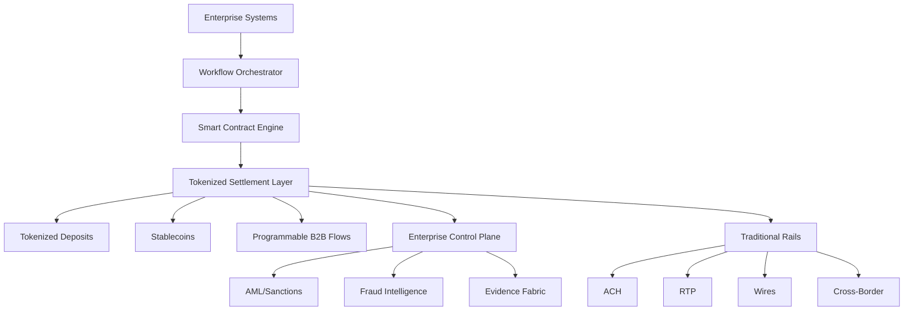

## AI‑Native Tokenized Money: Architecture, Settlement Models & Programmable B2B Flows
 Authored by Neeraj Aggarwal 2026

## Executive Summary
Tokenized money represents the next evolution of digital financial infrastructure, enabling programmable settlement, atomic transfers, and real‑time liquidity across enterprise payment systems. This whitepaper consolidates three foundational components of tokenized financial architecture:
Tokenized Deposits — digitally native bank liabilities with 1:1 redeemability
Stablecoin Settlement — programmable, cross‑border, 24x7 settlement assets
Programmable B2B Flows — conditional, automated, multi‑party payment workflows
Together, these constructs form the basis of a hybrid fiat–tokenized ecosystem that integrates seamlessly with existing rails (ACH, RTP, Wires, SWIFT) while enabling next‑generation financial automation.

This whitepaper provides a unified architectural blueprint for banks, fintechs, and enterprises preparing for the coexistence of traditional and tokenized money.

### 1. Introduction
The global financial system is undergoing a structural shift toward digitally native monetary instruments. Tokenized deposits, stablecoins, and programmable flows introduce new capabilities:
Instant settlement
Conditional payments
Multi‑party automation
Cross‑border efficiency
Real‑time liquidity visibility
This whitepaper defines the architecture, governance, and enterprise integration patterns required to operationalize tokenized money at scale.

### 2. Tokenized Deposits
2.1 Definition
Tokenized deposits are digitally native representations of bank deposits, issued by regulated institutions and backed 1:1 by traditional account balances.
2.2 Core Characteristics
Fully redeemable
Ledger‑agnostic
Programmable
Regulated
Interoperable
2.3 Architecture Components
Tokenization Engine — mint/burn, account mapping
Wallet Layer — identity, KYC, delegated authority
Settlement Layer — atomic transfers, conditional logic
Control Plane — AML, sanctions, fraud, evidence
2.4 Use Cases
Instant B2B settlement
Treasury optimization
Cross‑border corridors
Programmable liquidity

### 3. Stablecoin Settlement
3.1 Overview
Stablecoins provide a digitally native settlement asset with global interoperability and programmable capabilities.
3.2 Types
Fiat‑backed
Crypto‑collateralized
Algorithmic (not enterprise‑preferred)
3.3 Settlement Architecture
On‑chain settlement engine
Off‑chain reconciliation
Control plane integration
3.4 Cross‑Border Model
Stablecoins reduce:
FX friction
Intermediary hops
Settlement delays
3.5 Risks & Mitigations
Reserve transparency → audits
Smart‑contract risk → formal verification
Regulatory uncertainty → jurisdictional compliance

### 4. Programmable B2B Flows
4.1 Overview
Programmable flows enable conditional, automated, event‑driven settlement using tokenized money and smart contracts.
4.2 Core Concepts
Conditional settlement
Multi‑party workflows
Smart‑contract logic
Delegated authority
4.3 Architecture Components
Workflow orchestrator
Tokenized settlement engine
Enterprise control plane
ERP/Treasury integration
4.4 Example Flow
Milestone achieved
ERP triggers event
Smart contract validates
AML/sanctions checks
Tokenized settlement executes
Evidence logged

### 5. Unified Architecture Diagram 

### 6. Integration with Enterprise Payment Systems
Tokenized money must integrate with:
Multi‑rail orchestration
ISO 20022 semantic models
Enterprise control planes
AI‑native exception workflows
Treasury and ERP systems
This ensures coexistence, not replacement, of traditional rails.

### 7. AI‑Native Enhancements
AI augments tokenized money through:
Predictive settlement routing
Autonomous exception repair
Behavioral anomaly detection
Explainable compliance
Liquidity forecasting

### 8. Regulatory & Compliance Considerations
Tokenized money must comply with:
AML
Sanctions
Travel rule
KYC
Jurisdictional licensing
The Unified Intelligent Control Stack (UICS) provides the enforcement layer.

### 9. Conclusion
Tokenized money is not a future concept — it is an emerging operational reality.
 Banks, fintechs, and enterprises must prepare for a hybrid ecosystem where:
Fiat and tokenized money coexist
Settlement becomes programmable
Workflows become autonomous
Liquidity becomes real‑time
Compliance becomes AI‑native
This whitepaper provides the architectural foundation for that transition.

### 10. Citation (Zenodo‑Ready)
Aggarwal, Neeraj. (2026). AI‑Native Tokenized Money: Architecture, Settlement Models & Programmable B2B Flows. Zenodo. DOI: to be assigned.
